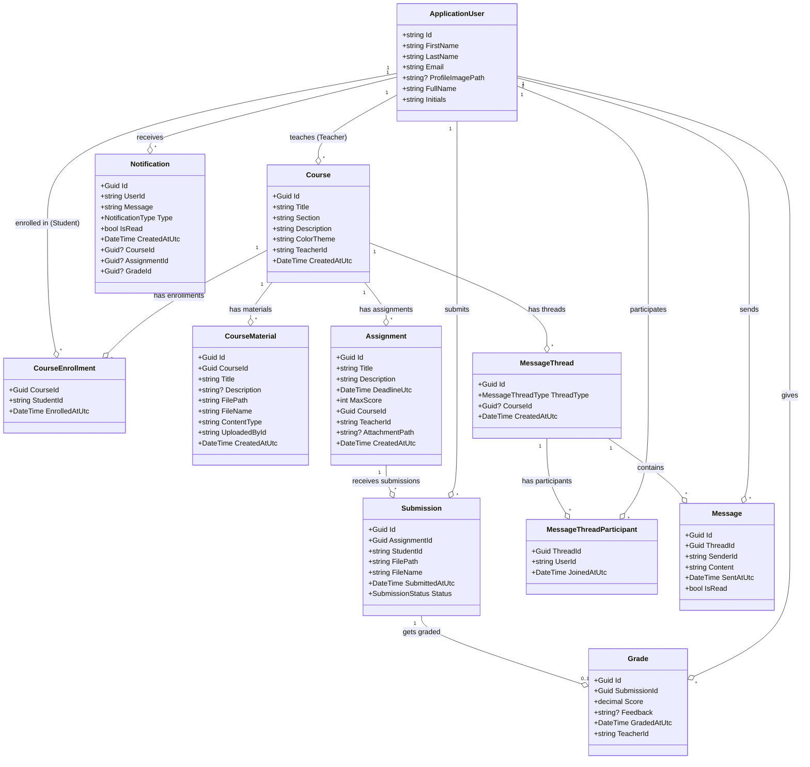

# UniClassroom — Diagrammes UML

## 1. Diagramme de Classes

---

## 2. Diagramme de Cas d'Utilisation

```mermaid
flowchart TD
    Admin([Administrateur])
    Teacher([Enseignant])
    Student([Etudiant])

    subgraph UC_Admin["Cas d'utilisation — Admin"]
        A1[Créer un compte utilisateur]
        A2[Supprimer un utilisateur]
        A3[Créer un cours]
        A4[Assigner un enseignant à un cours]
        A5[Inscrire un étudiant à un cours]
        A6[Désinscrire un étudiant]
        A7[Supprimer un cours]
        A8[Voir le tableau de bord]
    end

    subgraph UC_Teacher["Cas d'utilisation — Enseignant"]
        T1[Voir ses cours]
        T2[Publier un support de cours]
        T3[Créer un devoir]
        T4[Voir les rendus d'un devoir]
        T5[Noter un rendu]
        T6[Envoyer un message à un étudiant]
        T7[Voir le calendrier des deadlines]
        T8[Modifier son profil]
    end

    subgraph UC_Student["Cas d'utilisation — Etudiant"]
        S1[Voir ses cours inscrits]
        S2[Télécharger un support]
        S3[Voir les devoirs d'un cours]
        S4[Rendre un devoir]
        S5[Voir ses notes]
        S6[Envoyer un message à l'enseignant]
        S7[Voir le calendrier des deadlines]
        S8[Voir les notifications]
        S9[Modifier son profil]
    end

    Admin --> A1
    Admin --> A2
    Admin --> A3
    Admin --> A4
    Admin --> A5
    Admin --> A6
    Admin --> A7
    Admin --> A8

    Teacher --> T1
    Teacher --> T2
    Teacher --> T3
    Teacher --> T4
    Teacher --> T5
    Teacher --> T6
    Teacher --> T7
    Teacher --> T8

    Student --> S1
    Student --> S2
    Student --> S3
    Student --> S4
    Student --> S5
    Student --> S6
    Student --> S7
    Student --> S8
    Student --> S9
```

---

## 3. Tables SQL (noms significatifs)

| Classe C#                  | Table SQL                    |
|---------------------------|------------------------------|
| `ApplicationUser`         | `Users`                      |
| `Course`                  | `Courses`                    |
| `CourseEnrollment`        | `CourseEnrollments`          |
| `CourseMaterial`          | `CourseMaterials`            |
| `Assignment`              | `Assignments`                |
| `Submission`              | `Submissions`                |
| `Grade`                   | `Grades`                     |
| `Notification`            | `Notifications`              |
| `MessageThread`           | `MessageThreads`             |
| `MessageThreadParticipant`| `MessageThreadParticipants`  |
| `Message`                 | `Messages`                   |
| IdentityRole              | `Roles`                      |
| IdentityUserRole          | `UserRoles`                  |
